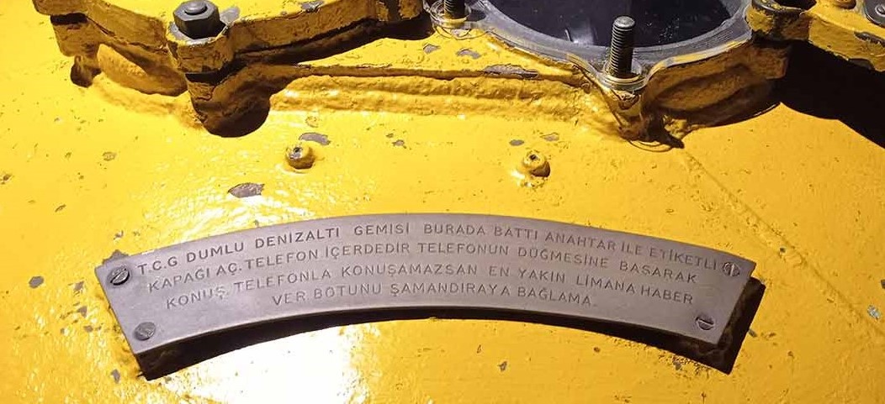
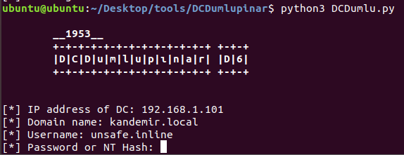

# DCDumlupinar D-6
DCDumlupınar aims to conduct enumeration and persistence on the Active Directory.



## Installation & Start up
```
pip3 install -r requirements.txt
python3 DCDumlu.py
```
Then provide `IP address of DC`, `Domain name`, `Username`, `Password or NT hash` for LDAP connection.  
:warning: **Please note that** `Username` must be like `sAMAccountName` value format and hash format must be like `LM:NT` or `NT:NT`.



## Usage
Commands | Descriptions
------------ | -------------
getHosts | Dump hosts information
getUsers | Dump users information
getGroups | Dump groups information
hostDescriptions | Dump description of hosts information
userDescriptions | Dump description of users information
getGroupMembers | Dump members of specified group
searchUser | Search specific user
searchHost | Search specific host
unconstrainedComputer | Enumerate unconstrained computer account
constrainedComputer | Enumerate constrained computer account
constrainedUser | Enumerate constrained user account
unconstrainedUser | Enumerate unconstrained user account
addUser | Add a user
addUserToGroup | Add a user to group
delUser | Delete a user
setSpn | Set a servicePrincipalName attribute
unSetSpn | Unset a servicePrincipalName attribute
addUnconstrained | Modify an object for delegation to any service with Kerberos Auth
addConstrained | Modify an object for delegation to specific service
addAsRepRoasting | Set user option as do not require Kerberos preauthentication for As-Rep Roasting attack
delAsRepRoasting | Set user option as Kerberos preauthentication is required
resetObject | Change userAccountControl attribute of object to reset modifications that are Kerberos delegation attacks
uacTable | Show values fo userAccountControl attribute if you need for resetObject operation
help | Print usage
exit | Exit
